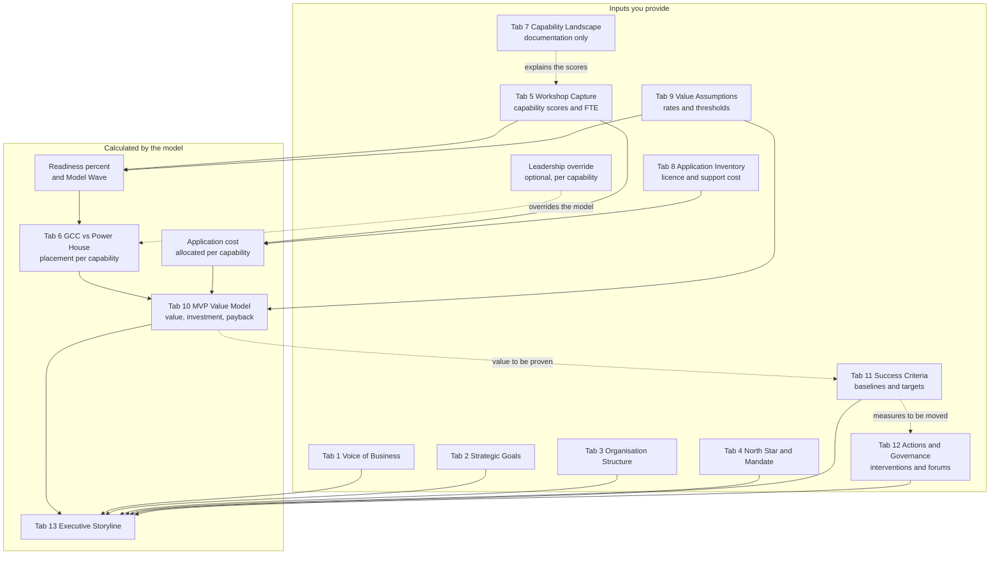

# GCC Value MVP Framework

A browser-based framework that takes a Global Capability Centre case from business evidence to a defensible MVP value model. Capture the Voice of Business, anchor it to strategic goals, score capability candidates in a workshop, and let the model produce the scope, value, investment, and payback the enterprise needs to make a decision.

No build step, no server dependency, no data leaves the browser. State is held in `localStorage` and can be exported to JSON.

**Live:** https://monicamehta.github.io/GCC-Value-MVP-Framework-Industry-Agnostic/

---

## Running it

**Easiest:** open the live link above, then click **Load Sample Data**.

**Locally on macOS:** double-click `Open GCC Value MVP.command`. It starts a local server and opens the app at `http://localhost:8000/`. Keep the Terminal window open while using it; press `Ctrl+C` to stop.

**Locally on Windows:** double-click `Open GCC Value MVP.bat` (requires Python 3 installed and on PATH — get it from python.org, tick "Add Python to PATH" during install). It starts a local server and opens the app.

**Locally on any OS with Python installed:** run `python3 serve.py` (or `python serve.py` on Windows) from the project folder, then open the URL it prints.

Opening `index.html` directly from Finder/Explorer (double-clicking the file) will not work — browsers block `file://` pages from loading local scripts. Symptoms look like: the page loads and the header buttons are visible, but **Load Sample Data** does nothing, and the **Import CSV/XLSX**, **Export CSV**, and **+ Add** controls never appear inside any tab. This means the JavaScript never ran — use one of the launchers above or the live link instead.

### Troubleshooting: buttons/import/export missing after sharing the files

If someone you shared the project with sees the page but nothing works (no sample data, no Add/Import/Export controls), it is almost always because they opened `index.html` directly instead of running it through a local server. Fix:

1. Confirm they have the whole folder, not just `index.html` — they need `style.css`, the `js/` folder, and one of the launcher files.
2. Have them run the matching launcher for their OS (`Open GCC Value MVP.command` on macOS, `Open GCC Value MVP.bat` on Windows) or `python3 serve.py`.
3. Confirm the browser address bar shows `http://localhost:...`, not `file://...`.
4. If Python is not installed, install Python 3 first (Windows: python.org, tick "Add to PATH"; macOS/Linux: usually pre-installed, check with `python3 --version`).
5. Open the browser DevTools console (F12) — a `file://` load shows script/CORS errors there, which confirms the diagnosis.

---

## Where data comes from

You provide seven tabs. The model produces the rest.

Changing anything in Tab 5 or Tab 9 recalculates Tabs 5, 6 and 10 together.

---

## What each tab is for

### Tab 1 — Voice of Business

**Captures:** what function leaders actually said, in their words: stakeholder, line of business, region, theme, pain point, business impact, verbatim quote, and the strategic goal the pain blocks.

**Feeds:** the Executive Storyline, and the traceability chain from evidence to goal to capability to value.

**Value it creates:** forces evidence before solution. A GCC case built on consultant assertion collapses under challenge; one built on named stakeholders saying specific things does not. The verbatim quote is deliberate — it is far harder for a sponsor to dismiss their own words. This is the tab that stops the programme being accused of being a cost exercise looking for a justification.

### Tab 2 — Strategic Goals

**Captures:** the three to five executive goals the GCC must serve, each with an accountable executive, horizon, success measure, and primary value type (cost, productivity, capability, speed, risk, revenue).

**Feeds:** linkage targets for Voice of Business entries and every capability candidate.

**Value it creates:** makes value traceable. Every dollar in the MVP model rolls up to a goal with a named owner, so finance can ask "which goal does this serve, and who owns it?" and get an answer. It also exposes the uncomfortable case where a capability has high value but links to no goal — usually a sign the scope is being padded.

### Tab 3 — Organisation Structure

**Captures:** region, line of business, team size (FTE), revenue, and operating cost. Contribution is calculated as revenue minus operating cost.

**Feeds:** business-economic context for the placement and value tabs; the FTE baseline reconciles to the workshop.

**Value it creates:** gives the case materiality. A $22M saving means something different against a $12B revenue base than a $500M one. Contribution per line of business shows which parts of the enterprise actually carry margin, so leadership can judge whether the GCC is being pointed at the right problem rather than the easiest one.

### Tab 4 — North Star & Mandate

**Captures:** per line of business — the business outcome the GCC owns, the decisions it can take alone, the products it owns, how success is judged, the ownership model, and explicitly what the power house retains.

**Feeds:** the Executive Storyline. Flags lines of business with capabilities but no mandate, and mandates that are advisory-only.

**Value it creates:** this is the tab that determines whether you build a capability centre or a cost centre. Decision rights stated in advance, with a financial threshold, are the difference between a GCC that owns outcomes and one that takes instructions. The "Power House Retains" column is equally important: an unstated boundary gets relitigated in month six. The mandate-gap warning is deliberate friction — scoring work for transfer without an agreed outcome is how GCCs end up measured on activity.

### Tab 5 — Workshop Capture (primary input)

**Captures:** each capability scored live on five 1–5 dimensions — standardization, remote transferability, automation/AI potential, data & platform readiness, and local/regulatory constraint — plus FTE and optional cost overrides.

**Model calculates:** readiness %, transferable FTE, annual value, investment, **Model Wave** and **MVP Wave**.

**Value it creates:** the room sees the value consequence of every scoring decision immediately. When someone argues a score up from 3 to 4, the annual value moves on screen, which converts a subjective debate into an accountable one. Scoring local constraint *inverted* is the honest mechanic: high regulatory constraint correctly suppresses readiness rather than being quietly ignored.

### Tab 6 — GCC vs Power House

**Generated from Tab 5.** One row per capability, refreshed whenever scores or assumptions change. Shows **Model Says** alongside **Agreed Decision**, with a **Source** badge of Model or Leadership.

**Value it creates:** separates the calculation from the judgement and keeps both visible. The model recommends from readiness alone; leadership can override any capability using business value, strategic importance, or technology sharedness — factors the score does not contain. Overrides are never recalculated, and deleting one returns the capability to the model.

The variance count is the point: when a board asks "why is this one staying when it scores 85%?", the answer is recorded rather than reconstructed. Move + Hybrid + Remain always reconciles to the capability count, so nothing hides.

### Tab 7 — Capability Landscape

**Captures:** business capability to sub-process to supporting applications, with a coverage rating (Full, Partial, Manual Workaround, None).

**Feeds:** nothing calculational — this is documentation.

**Value it creates:** shows *why* a readiness score is what it is. A capability rated Manual Workaround explains a low data-readiness score far better than the number alone, and points at the fix. Useful in the room when a sponsor challenges a score. Note that this tab does not affect readiness, waves, or value.

### Tab 8 — Application & Information Architecture

**Captures:** application inventory (vendor, hosting, integration, criticality, annual licence and support cost) and the data flows between systems.

**Feeds:** licence and support cost is attributed to the application's line of business, then split across that line's capabilities by FTE, and becomes a value lever in the MVP model.

**Value it creates:** puts technology run cost into the business case instead of leaving it as a separate IT conversation. Only the transferred share of a capability's application cost can be saved, and licence saving defaults to **0%** because licences are usually still paid to the vendor after a transfer — claiming otherwise is what gets a case rejected. Application cost that cannot reach any capability is flagged rather than silently dropped.

### Tab 9 — Value Assumptions

**Captures:** every rate and threshold — onshore and GCC cost per FTE, setup cost, parallel run months, maximum transfer share, automation and application saving rates, wave thresholds, ramp profile, and placement thresholds. Includes a full calculation table.

**Feeds:** everything. Changes here recalculate Tabs 5, 6 and 10 together.

**Value it creates:** makes the case transparent rather than asserted. Every number is derived from these assumptions plus the workshop scores, and the formula table means finance can audit the logic without reading code. It is also the sensitivity tool: move the Wave 1 threshold and watch scope and value move, which answers "how robust is this?" in seconds.

The parallel-run assumption deserves attention — it is the cost most often omitted from GCC cases, and it is calculated here rather than assumed away.

### Tab 10 — MVP Value Model

**Shows:** annual value at maturity, one-time investment broken into setup / parallel run / other transition, three-year net value, ROI, payback year, and FTE in scope. Value is decomposed into five levers — labour arbitrage, automation & AI, application savings, risk avoidance, revenue enablement — with charts and a full capability-level detail table, exportable to CSV.

**Value it creates:** this is the decision artefact. It answers the only three questions an executive committee asks: what value, what cost, when does it pay back. The lever decomposition matters because a case that is 100% labour arbitrage is a different proposition from one with automation and risk avoidance — the first is a one-off saving, the second is a capability. Capabilities retained at the power house claim zero value, so the total is never inflated by work that is not moving.

### Tab 11 — Success Criteria

**Captures:** per measure — the value horizon (Deliver Better, Operate Better, Change the Game), the success measure, line of business, verified baseline, year 1 and year 3 targets, accountable owner, and review cadence.

**Feeds:** the Executive Storyline, and a coverage check against the MVP scope.

**Value it creates:** this is what converts a forecast into an accountable commitment. Tab 10 says what value the GCC *should* create; this tab is how anyone will ever know whether it did.

The tab deliberately makes two failures visible. First, a criterion with no verified baseline cannot be proven — a benefit with no starting point gets challenged by finance and cannot be claimed, so the share of annual value actually covered by a measurable baseline is shown in cash terms. Second, a line of business can be in the MVP with nothing agreed to measure it by; those are listed by name, because transferring work without a measure of whether the transfer worked is how a GCC loses its mandate at the first review.

The horizon split matters commercially: a scorecard weighted only to Operate Better proves a saving, while one carrying Change the Game measures proves a capability. That is the difference between a cost centre and a capability centre.

### Tab 12 — Actions & Governance

**Captures:** two registers. **Value actions** — the intervention, the success measure it serves, its type (new capability build, process standardisation, automation & AI, data foundation, technology, knowledge transfer, decision rights, people & retention), line of business, accountable owner, wave, status, and governing forum. **Governance forums** — the decisions each forum owns, its chair, members, cadence, inputs reviewed, and escalation path.

**Feeds:** the Executive Storyline, and coverage checks back against Tab 11.

**Value it creates:** a target does not move because it was written down. This is the tab that closes the gap between a forecast and a delivered number, by forcing two links for every measure — *what are we actually doing about it*, and *who will make sure it happens*.

It flags three failures that otherwise surface a year late: a **success measure with no action against it** is an aspiration and cannot improve; an **action with no named owner** slips quietly; an **action reviewed by no forum** is discovered late. Blocked actions are listed separately with their owner so they can be escalated rather than left to sit.

The action-type split is the honest test of ambition. A plan that is entirely process standardisation delivers a saving; one carrying new capability build and automation delivers a capability. That distinction is what separates a GCC that survives its second budget cycle from one that does not.

### Tab 13 — Executive Storyline

**Generates:** a narrative connecting business evidence to the value case across nine blocks — what the business told us, the goals, the mandate, what moves and stays, MVP scope, value created, where value comes from, what is deliberately not moving, how success is measured, and what must be decided now. Downloadable as text.

**Value it creates:** removes the gap between the model and the readout. Because it is generated from live data, the narrative can never contradict the numbers — a common and fatal failure in manually written board packs. The "what we are deliberately not moving" block is the credibility device: a case that claims everything transfers is not believed, while one that names what stays and why is.

---

## How the value is calculated

| Measure | Calculation |
|---|---|
| Readiness % | Average of the five workshop scores, with local constraint inverted, rescaled to 0–100% |
| Transferable FTE | Current FTE × min(readiness %, maximum transfer share %) |
| Labour arbitrage | Transferable FTE × (onshore cost per FTE − GCC cost per FTE) |
| Automation value | Transferable FTE × GCC cost per FTE × (automation potential / 5 × maximum automation saving %) |
| Application cost allocation | Each application's licence and support cost attributed to its line of business, split across that line's capabilities by FTE |
| Application saving | Allocated cost × transfer share % × the relevant saving % |
| Parallel run cost | Transferable FTE × GCC cost per FTE × (parallel run months / 12) |
| Investment | Setup cost + one-time transition cost + parallel run cost |
| Payback | First year where cumulative realised value exceeds cumulative investment |
| MVP wave | Readiness against the thresholds, unless leadership recorded an override in Tab 6 |

Placement outcomes, decided by readiness against the Tab 9 thresholds:

- **Move to GCC** — readiness at or above the Wave 1 threshold; enters the MVP.
- **Hybrid / Shared** — readiness between the Wave 2 and Wave 1 thresholds; part of the work transfers, but local judgement, regulatory sign-off, or unfinished data foundations mean the GCC and the power house run it together.
- **Remain at Power House** — readiness below the Wave 2 threshold; nothing transfers and no value is claimed until the constraint is fixed.

---

## Importing your own data

Every register supports CSV and XLSX import using the exported column headers. On import you are asked whether to replace the existing rows or add to them.

Importing into the Tab 6 placement register marks every imported row as a **Leadership** override, so a file of agreed decisions will take precedence over the model until those rows are deleted.

**Export JSON** captures the entire engagement; **Import JSON** restores it.

---

## Project structure

| File | Purpose |
|---|---|
| `index.html` | Shell and tab containers |
| `js/model.js` | Schema, persistence, and every value calculation |
| `js/app.js` | UI layer, registers, and tab renderers |
| `js/charts.js` | Pure SVG chart helpers, no chart library |
| `js/seedData.js` | Illustrative dataset loaded by **Load Sample Data** |
| `style.css` | Styling |
| `Open GCC Value MVP.command` | macOS launcher |
